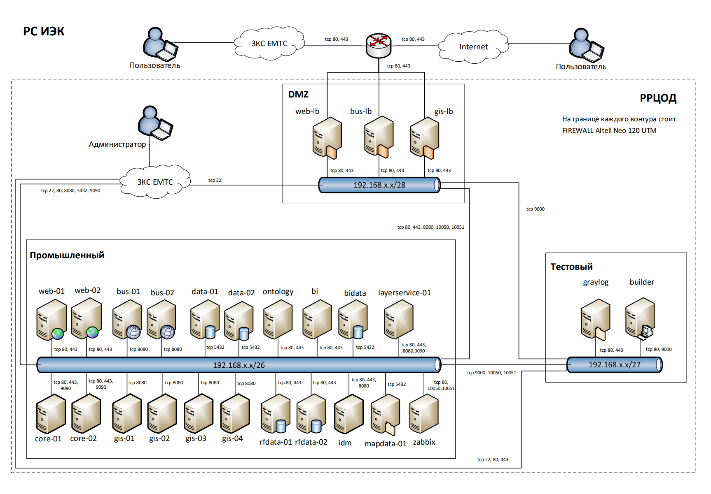
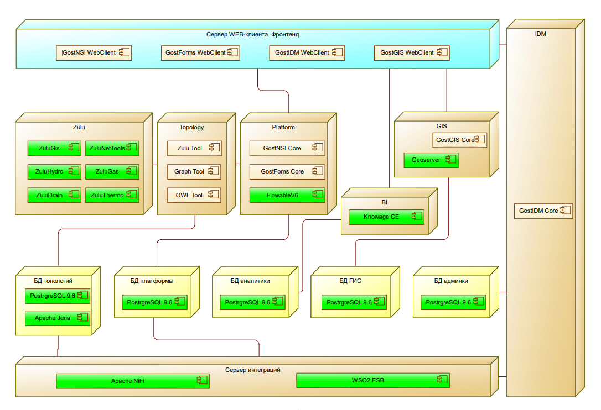
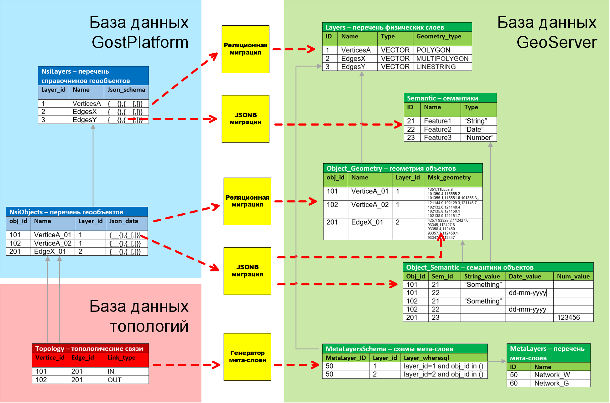
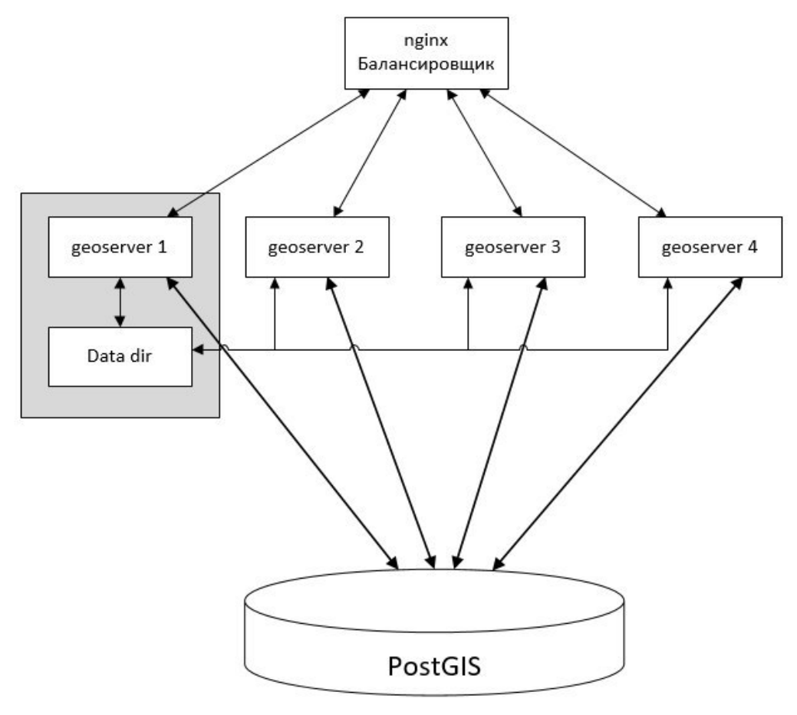

**Implementation Period:** October 2017 — January 2020
**Full title:** State Information System "Engineering and Energy Complex of St. Petersburg"
**Contractor:** Gost Group  
**Consumer:** Committee for Energy and Engineering Support of St. Petersburg  
**Customer:** St. Petersburg Information and Analytical Center  
**Project Role:** System Architect  
**Team Size:** 30 specialists

## Project Description

The State Information System "Engineering and Energy Complex of St. Petersburg" is an advanced digital platform for comprehensive monitoring, strategic planning, and efficient management of the engineering and energy infrastructure of the metropolis. The system was developed as part of the "Effective Region" program, supervised by the Committee for Informatization and Communications of St. Petersburg, and is aimed at significantly improving the quality of urban management through the implementation of lean technologies and innovative digital solutions.

## Purpose

RS IEC was created to automate the powers of the Committee for Energy and Engineering Support of St. Petersburg, as well as to significantly increase the efficiency of state management in ensuring the functioning of the engineering and energy complex and engineering infrastructure facilities of the city. The implementation of the system allows achieving a qualitatively new level of management through the use of modern information and telecommunication technologies and analytical tools.

## Key Functions

- **Intelligent Monitoring of Energy Facilities:** Comprehensive integration with a network of sensors and automated accounting systems for real-time data collection and processing.
- **Predictive Analytics:** Application of advanced algorithms for energy consumption optimization, equipment wear forecasting, and prevention of emergency situations.
- **Centralized Management of Engineering Networks:** Unified center for control and coordination of water supply, heat supply, and electricity supply systems of the city.
- **Seamless Integration with Urban Services:** Full compatibility with the St. Petersburg public services portal and other digital platforms of the urban ecosystem.

## Technologies and Approaches

- **Innovative Digital Engineering:** Methodologies similar to those used in PLM-systems have been applied for effective management of the complete lifecycle of infrastructure objects.
- **Multi-level Security System:** Recommendations from SPb IAC experts on protection against DDoS attacks and other modern cyber threats have been implemented.
- **Horizontal and Vertical Scalability:** The system architecture is designed with the possibility of connecting new functional modules, such as housing and communal services management systems, which fully corresponds to the concept of "smart city" development.

## Technical Implementation

- **Backend:** Java Spring Boot, PostgreSQL with spatial extensions, REST API
- **Frontend:** React.js, Redux, modern responsive interface
- **Geographic Information System:** Deep integration with GIS for multi-layer visualization of engineering infrastructure objects
- **Data Integration Center:** Comprehensive collection and processing of data from heterogeneous sources, including monitoring and management systems
- **Analytical Core:** Specialized modules for comprehensive analysis of network conditions, forecasting emergency situations, and evaluating energy consumption efficiency

## Implementation Results

- Creation of a unified integrated platform for comprehensive management of the engineering and energy infrastructure of the metropolis
- Significant increase in the efficiency of budget funds allocated for the development and modernization of urban engineering infrastructure
- Systematic optimization of planning processes and implementation of investment programs
- Significant improvement in the quality of public services in the field of energy and engineering support
- Increased transparency and accessibility of information for all stakeholders

## Subsystems

### Accounting and Management
- Reference books and classifiers
- Accounting of engineering and energy complex objects
- Targeted investment programs
- Government programs
- Investment programs of resource supplying organizations

### Visualization and Modeling
- Geographic information component
- Graphical representation of schematic diagrams of engineering and technical support networks
- Construction and repair projects for engineering and energy complex objects

### Integration and Data Processing
- Interaction services
- Verification and transformation of data
- Situational management

### Analytics and Forecasting
- Prediction of emergency situations
- Preparation for the heating season
- Monitoring of technological connections
- Balance calculation

### Energy Efficiency
- Energy saving and energy efficiency management
- Energy service contracts
- Control of fuel, energy, and water savings

### Analytical Services
- Analysis of investment programs
- Analysis of network conditions
- Analytics on energy saving and energy efficiency
- Executive dashboard

### System Administration
- Administration
- Information security system

# System Architecture

## Proof of Concept
The basic architecture of the system is implemented on the GostPlatform, providing the necessary flexibility and performance to solve the assigned tasks.

## Structure of Computational Modules
The multi-level architecture ensures a clear separation of responsibilities between system components and optimal performance in data processing.

## Component Diagram
The modular structure of the system allows for independent development and testing of individual components, as well as providing the possibility of flexible scaling.

## Network Interaction Scheme
Optimized organization of network interaction guarantees high availability of services and effective protection against unauthorized access.

## Deployment Diagram
A well-thought-out deployment strategy ensures stable system operation under high loads and minimizes recovery time after failures.

## Geographic Information Component

### Data Synchronization Model
A highly efficient spatial data synchronization model has been implemented, ensuring the relevance of information for all system users.

### GeoServer Clustering
The GeoServer cluster provides increased performance when processing WFS and WMS requests, the possibility of dynamic system scaling, as well as a high level of reliability and availability of geoinformation services.

One of the standard topologies has been implemented — a peer-to-peer network with built-in brokers and a shared data catalog. All GeoServer instances are interchangeable and have identical **master/slave** configurations. The data catalog for all GeoServer instances is shared and placed in a separate directory. Each GeoServer is located on a separate virtual machine.

Request distribution to GeoServers is handled by Nginx, configured for uniform distribution of WFS and WMS requests using sticky cookie *JSESSIONID* technology.

Configuration change requests, including REST API requests and access to the GeoServer web interface, are processed by one dedicated GeoServer instance. The remaining instances are configured to process such requests in fail-over mode. In case of failure of the primary GeoServer instance, configuration change requests are automatically redirected to the next instance in the list. When functionality is restored, request redirection is performed in reverse order.

The cluster includes one Nginx load balancer and four GeoServer instances with a shared external data catalog. The architecture uses built-in brokers and GeoWebCache technology to optimize performance.

## User Interface
### Wireframes


# Launch presentation


