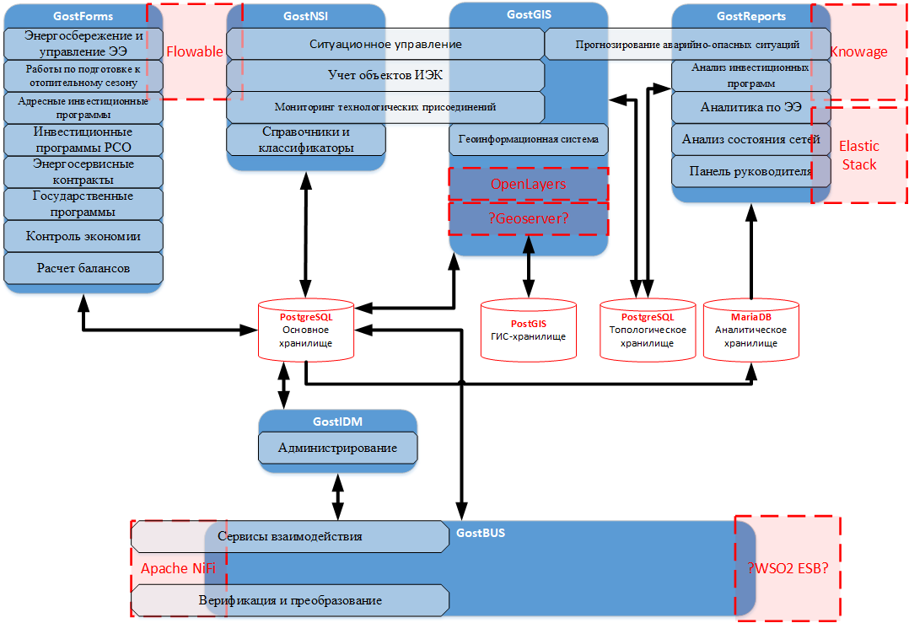
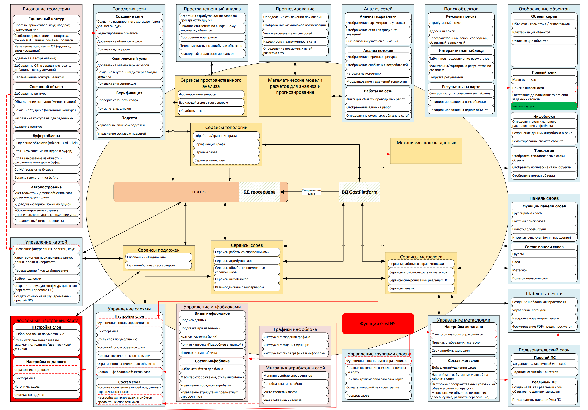
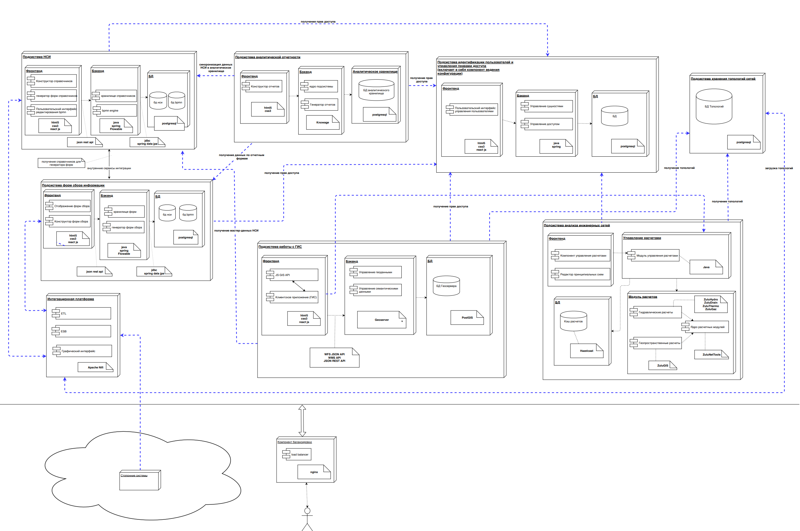
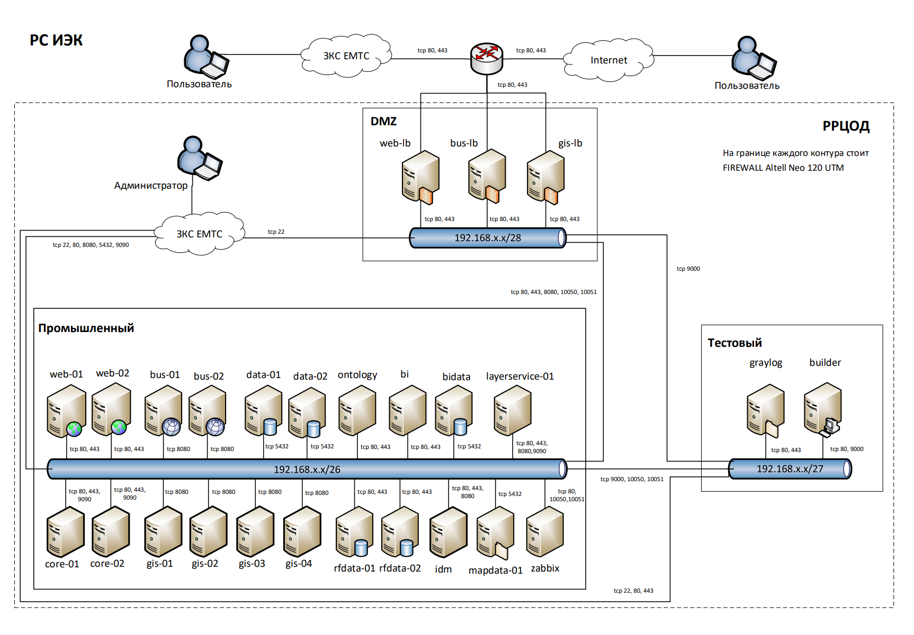
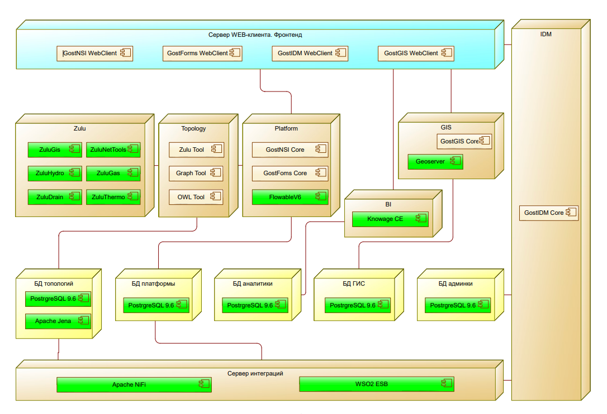
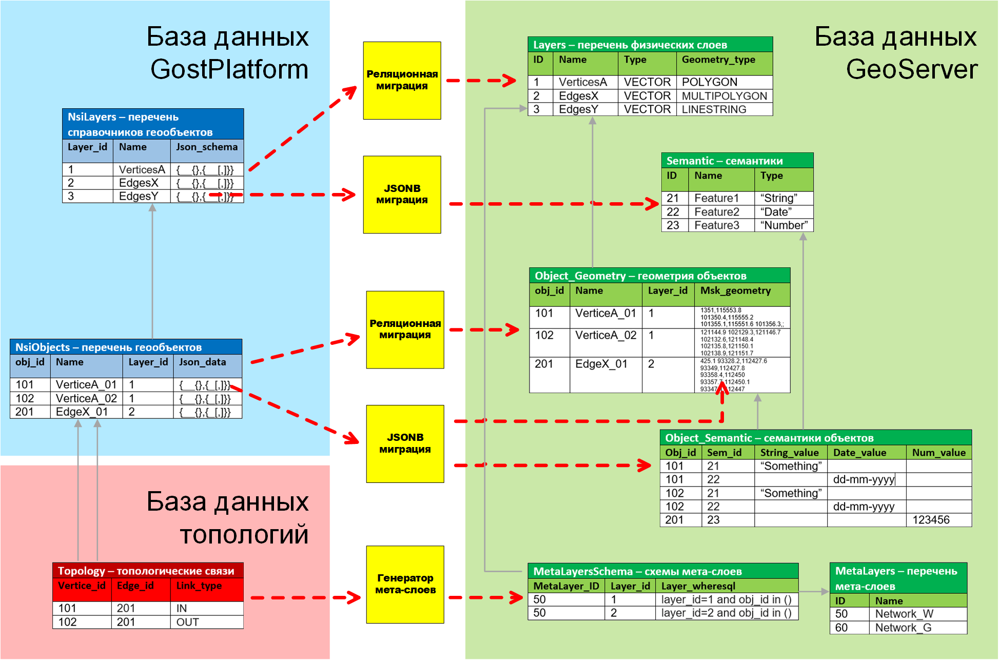
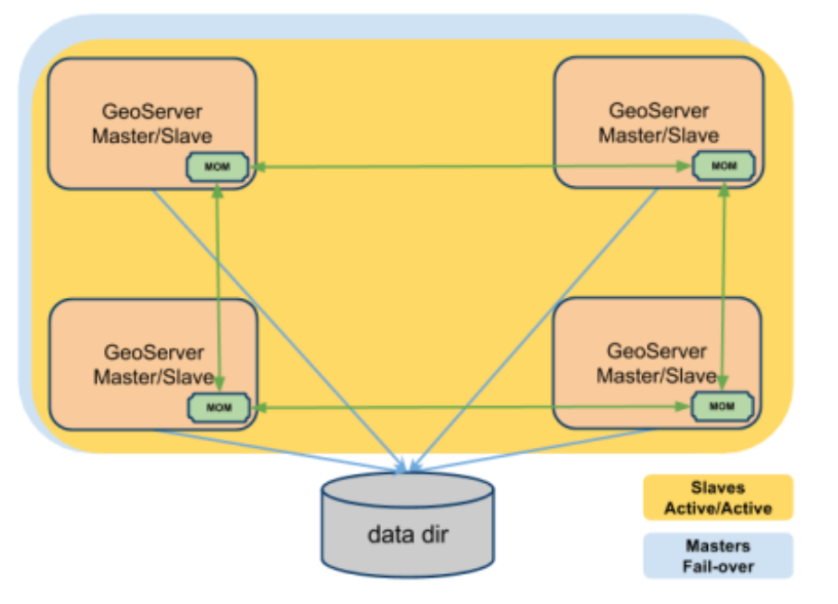
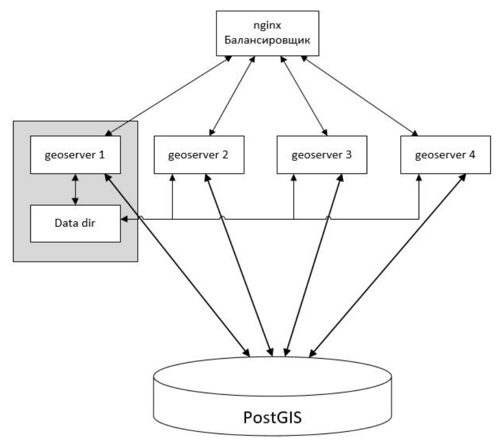

 - **Период реализации:** Октябрь 2017 — Январь 2020
 - **Наименование:**  Государственная информационная система «Инженерно-энергетический комплекс Санкт-Петербурга»
 - **Исполнитель:** Gost Group
 - **Потребитель:** Комитет по энергетике и инженерному обеспечению Санкт-Петербурга
 - **Заказчик:** СПб ГУП «Санкт-Петербургский информационно-аналитический центр»
 - **Роль в проекте:** Архитектор системы
 - **Размер команды:** 30 специалистов

## Описание проекта

Государственная информационная система «Инженерно-энергетический комплекс Санкт-Петербурга» представляет собой передовую цифровую платформу для комплексного мониторинга, стратегического планирования и эффективного управления инженерной и энергетической инфраструктурой мегаполиса. Система разработана в рамках реализации программы «Эффективный регион», курируемой Комитетом по информатизации и связи Санкт-Петербурга, и направлена на существенное повышение качества городского управления через внедрение бережливых технологий и инновационных цифровых решений.

## Назначение

РС ИЭК создана для автоматизации полномочий Комитета по энергетике и инженерному обеспечению Санкт-Петербурга, а также значительного повышения эффективности государственного управления в сфере обеспечения функционирования инженерно-энергетического комплекса и объектов инженерной инфраструктуры города. Внедрение системы позволяет достичь качественно нового уровня управления за счет использования современных информационно-телекоммуникационных технологий и аналитических инструментов.

## Ключевые функции

- **Интеллектуальный мониторинг энергетических объектов:** Реализована комплексная интеграция с сетью датчиков и автоматизированными системами учета для сбора и обработки данных в режиме реального времени.
- **Предиктивная аналитика:** Применение передовых алгоритмов для оптимизации энергопотребления, прогнозирования износа оборудования и предотвращения аварийных ситуаций.
- **Централизованное управление инженерными сетями:** Единый центр контроля и координации систем водоснабжения, теплоснабжения и электроснабжения города.
- **Бесшовная интеграция с городскими сервисами:** Полноценная совместимость с порталом государственных услуг Санкт-Петербурга и другими цифровыми платформами городской экосистемы.

## Технологии и подходы

- **Инновационный цифровой инжиниринг:** Применены методологии, аналогичные используемым в PLM-системах для эффективного управления полным жизненным циклом инфраструктурных объектов.
- **Многоуровневая система безопасности:** Реализованы рекомендации экспертов СПб ИАЦ по обеспечению защиты от DDoS-атак и других современных киберугроз.
- **Горизонтальная и вертикальная масштабируемость:** Архитектура системы спроектирована с учетом возможности подключения новых функциональных модулей, таких как системы управления ЖКХ, что полностью соответствует концепции развития «умного города».

## Техническая реализация

- **Backend:** Java Spring Boot, PostgreSQL с пространственными расширениями, REST API
- **Frontend:** React.js, Redux, современный адаптивный интерфейс
- **Геоинформационная система:** Глубокая интеграция с ГИС для многослойной визуализации объектов инженерной инфраструктуры
- **Центр интеграции данных:** Комплексный сбор и обработка данных из разнородных источников, включая системы мониторинга и управления
- **Аналитическое ядро:** Специализированные модули для всестороннего анализа состояния сетей, прогнозирования аварийных ситуаций и оценки эффективности энергопотребления

## Результаты внедрения

- Создание единой интегрированной платформы для комплексного управления инженерно-энергетической инфраструктурой мегаполиса
- Существенное повышение эффективности использования бюджетных средств, направляемых на развитие и модернизацию городской инженерной инфраструктуры
- Системная оптимизация процессов планирования и реализации инвестиционных программ
- Значительное улучшение качества предоставления государственных услуг в сфере энергетики и инженерного обеспечения
- Повышение прозрачности и доступности информации для всех заинтересованных сторон

## Подсистемы

### Учет и управление
- Справочники и классификаторы
- Учет объектов инженерно-энергетического комплекса
- Адресные инвестиционные программы
- Государственные программы
- Инвестиционные программы ресурсоснабжающих организаций

### Визуализация и моделирование
- Геоинформационная составляющая
- Графическое представление принципиальных схем сетей инженерно-технического обеспечения
- Проекты строительства и ремонта объектов инженерно-энергетического комплекса

### Интеграция и обработка данных
- Сервисы взаимодействия
- Верификация и преобразование данных
- Ситуационное управление

### Аналитика и прогнозирование
- Прогнозирование аварийно-опасных ситуаций
- Работы по подготовке к отопительному сезону
- Мониторинг технологических присоединений
- Расчет балансов

### Энергоэффективность
- Энергосбережение и управление энергетической эффективностью
- Энергосервисные контракты
- Контроль экономии топливно-энергетических ресурсов и воды

### Аналитические сервисы
- Анализ инвестиционных программ
- Анализ состояния сетей
- Аналитика по энергосбережению и энергетической эффективности
- Панель руководителя

### Системное администрирование
- Администрирование
- Система защиты информации

# Архитектура системы

## Proof of concept
Базовая архитектура системы реализована на платформе GostPlatform, обеспечивающей необходимую гибкость и производительность для решения поставленных задач.

## Структура вычислительных модулей
Многоуровневая архитектура обеспечивает четкое разделение ответственности между компонентами системы и оптимальную производительность при обработке данных.

## Диаграмма компонентов
Модульная структура системы позволяет независимо разрабатывать и тестировать отдельные компоненты, а также обеспечивает возможность гибкого масштабирования.

## Схема сетевого взаимодействия
Оптимизированная организация сетевого взаимодействия гарантирует высокую доступность сервисов и эффективную защиту от несанкционированного доступа.

## Диаграмма разворачивания
Продуманная стратегия развертывания обеспечивает стабильную работу системы в условиях высоких нагрузок и минимизирует время восстановления после сбоев.

## Геоинформационная составляющая

## Модель синхронизации данных
Реализована высокоэффективная модель синхронизации пространственных данных, обеспечивающая актуальность информации для всех пользователей системы.

## Кластеризация геосервера
Кластер геосерверов обеспечивает повышенную производительность при обработке WFS и WMS запросов, возможность динамического масштабирования системы, а также высокий уровень надежности и доступности геоинформационных сервисов.

Реализована одна из стандартных топологий — одноранговая сеть со встроенными брокерами и общим каталогом данных. Все экземпляры геосерверов взаимозаменяемы и имеют идентичную конфигурацию **master/slave**. Каталог данных для всех экземпляров геосерверов общий и вынесен в отдельную директорию. Каждый геосервер располагается на отдельной виртуальной машине.

Распределение запросов к геосерверам осуществляет Nginx, сконфигурированный на равномерное распределение WFS и WMS запросов с применением технологии sticky cookie *JSESSIONID*.

Запросы на изменение конфигурации, включая запросы по REST API и обращения к веб-интерфейсу геосервера, обрабатываются одним выделенным экземпляром геосервера. Остальные экземпляры настроены на обработку таких запросов в режиме fail-over. При отказе первичного экземпляра геосервера запросы на изменение конфигурации автоматически перенаправляются на следующий экземпляр в списке. При восстановлении работоспособности перенаправление запросов выполняется в обратном порядке.

Кластер включает в себя один nginx-балансировщик и четыре экземпляра геосервера с общим вынесенным каталогом данных. В архитектуре используются встроенные брокеры и технология GeoWebCache для оптимизации производительности.

## WEB-интерфейс
### Wireframes


# Презентация запуска системы


