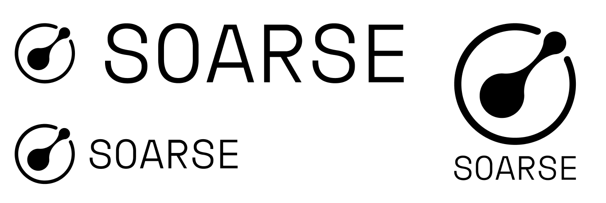

## Next-Generation Low-Code Platform

**Soarse** is an ambitious startup where I served as CEO and lead architect. We developed a **universal automation platform** capable of competing with global leaders in the Low-Code solutions market.

---

### 🧠 Concept and Philosophy

We didn't just write code. We designed an ecosystem. Soarse is a manifesto for a new culture of corporate information system development, where users become the architects of their own solutions.

At its core are **five builders** that can be combined to create any automated system:

- 📊 Data Builder
- 🔁 Process Builder
- 🖼 Interface Builder
- 🧮 Calculation Builder
- 🔌 API Builder

The system could be used as an all-in-one platform (MDM, CMS, CRM, ECM, PIM, WMS, DAM, etc.) or as a set of independent modules integrated into existing infrastructure.

---

### 🏗 Architecture

We bet on a **microservices approach**:

- Java, Spring Boot, Spring Cloud, PostgreSQL, Redis, RabbitMQ
- Metrics via Micrometer + Prometheus + Grafana
- Logging via Filebeat, Logstash, Elasticsearch, Kibana
- Tracing via OpenZipkin
- Network — Consul, Nginx, Netty
- CI/CD: Docker + Testcontainers
- Frontend — ReactJS + TypeScript

All components scale horizontally, deploy in Docker Swarm, support hot-reload, and operate 24/7.

---

### 🔐 Security and Access

We implemented our own version of **ABAC (Attribute-Based Access Control)**:

- Flexible access policies not tied to roles
- Context-based data filtering
- Semantic access models (ontologies)
- Ability to describe policies in a DSL-like language

The ABAC mechanism was separated into a standalone microservice and can be used independently from the platform—as a ready-to-use library.

---

### ⚙️ Data Management

- Non-relational model with object typing
- Versioning of schemas and data
- Support for multidimensional tables and multilingualism
- Calculated fields, contextual values, deduplication, normalization
- Metadata, classification, quality control

Every attribute is a full-fledged object with behavior, logic, and change history.

---

### 📈 Business Process Management

Soarse included a powerful BPM engine:

- Process triggers via events, schedules, APIs, or data changes
- Custom and system tasks, rules, conditions, scripts
- Archiving, logging, retrospectives

Unique feature: We built BPM support not around BPMN but around an intuitive form understandable even to non-programmers.

---

### 💻 Interfaces and UI

- Interface designer in a "website builder" style but with logic
- Interactive widgets, analytics, dashboards
- Mobile app based on webview and adaptive design
- Theming, corporate branding support

---

### 🔗 Integrations

- API Builder — generate endpoints without code
- Queues for bulk operations
- REST, WebSocket, File, DB connectors
- Support for ETL pipelines (Apache NiFi)

---

## 🧠 Company Organization

### Company Management

A three-tier **Result–Process–Tool** model was implemented, with three key roles: CEO, COO, CTO. Management followed the **Harzburg model of delegation**—highly decentralized and transparent.

### Participatory Management

We introduced elements of **universal participation**: voting on regulations, open information, horizontal connections. Yes, it sounds utopian, but it worked—as long as the team was small.

### Hiring and Relocation

- Individuals, sole proprietors, freelancers—all equal in rights
- Relocation program after company launch

---

## 💰 Financial Model

### 1. Direct Licensing
- Partners gain the right to sell licenses
- Soarse earns licensing revenue + % of margin

### 2. SaaS
- Cloud version of Soarse for small businesses
- Subscription model, industry-specific templates

---

## Materials

### Brand



### Marketing


### Skolkovo
