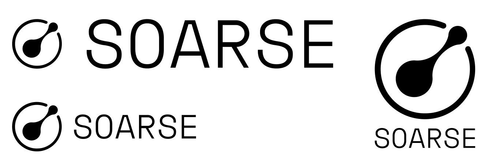

## Low-Code платформа нового поколения

**Soarse** — это амбициозный стартап, в котором я выступал в роли CEO и главного архитектора. Мы создавали **универсальную платформу автоматизации**, способную конкурировать с лидерами мирового рынка Low-Code решений.

---

### 🧠 Концепция и философия

Мы не просто писали код. Мы проектировали экосистему. Soarse — это манифест новой культуры разработки корпоративных информационных систем, где пользователи сами становятся архитекторами своих решений. 

В основе — **пять конструкторов**, из которых можно собрать любую нужную автоматизированную систему:

- 📊 Конструктор данных
- 🔁 Конструктор процессов
- 🖼 Конструктор интерфейса
- 🧮 Конструктор вычислений
- 🔌 Конструктор API

Систему можно было использовать как all-in-one платформу (MDM, CMS, CRM, ECM, PIM, WMS, DAM и т.п.), либо как набор независимых модулей, встраиваемых в существующую инфраструктуру.

---

### 🏗 Архитектура

Мы сделали ставку на **микросервисный подход**:

- Java, Spring Boot, Spring Cloud, PostgreSQL, Redis, RabbitMQ
- Метрики через Micrometer + Prometheus + Grafana
- Логи через Filebeat, Logstash, Elasticsearch, Kibana
- Трассировка через OpenZipkin
- Сеть — Consul, Nginx, Netty
- CI/CD: Docker + Testcontainers
- Фронт — ReactJS + TypeScript

Все компоненты масштабируются горизонтально, разворачиваются в Docker Swarm, поддерживают hot-reload и работают 24/7.

---

### 🔐 Безопасность и доступ

Мы реализовали собственную версию **ABAC (Attribute-Based Access Control)**:

- Гибкие политики доступа, не завязанные на роли
- Поддержка фильтрации данных по контексту
- Семантические модели доступа (онтологии)
- Возможность описывать политики на DSL-подобном языке

Механизм ABAC был вынесен в отдельный микросервис и может использоваться независимо от платформы — как готовая библиотека.

---

### ⚙️ Управление данными

- Нереляционная модель с объектной типизацией
- Версионирование схем и данных
- Поддержка многомерных таблиц и мультиязычности
- Вычисляемые поля, контекстные значения, дедупликация, нормализация
- Метаданные, классификация, контроль качества

Каждый атрибут — полноценный объект с поведением, логикой и историей изменений.

---

### 📈 Управление бизнес-процессами

Soarse включал в себя мощный BPM-движок:

- Запуск процессов по событиям, расписанию, API, изменению данных
- Пользовательские и системные задачи, правила, условия, скрипты
- Архивирование, логирование, ретроспектива

Особенность: поддержку BPM мы строили не вокруг BPMN, а вокруг максимально интуитивной формы, понятной даже непрограммисту.

---

### 💻 Интерфейсы и UI

- Дизайнер интерфейсов в стиле "конструктор сайтов", но с логикой
- Интерактивные виджеты, аналитика, дашборды
- Мобильное приложение на базе webview и адаптивной верстки
- Темизация, поддержка корпоративного брендбука

---

### 🔗 Интеграции

- Конструктор API — генерация эндпоинтов без кода
- Очереди для bulk-операций
- REST, WebSocket, File, DB коннекторы
- Поддержка ETL-пайплайнов (Apache NiFi)

---

## 🧠 Организация компании 

### Управление компанией

Была внедрена трехзвенная модель **Результат–Процесс–Инструмент** с тремя ключевыми ролями: CEO, COO, CTO.
Управление строилось по **гарцбургской модели делегирования** — максимально децентрализованно и прозрачно.

### Партисипативное управление

Мы внедрили элементы **всеобщего участия**: голосование по регламентам, открытость информации, горизонтальные связи. Да, звучит утопично, но работало — пока команда была небольшой.

### Найм и релокация

- Физлица, ИП, самозанятые — все равны в правах
- Программа релокации после запуска компании

---

## 💰 Финансовая модель
### 1. Direct Licensing
- Партнеры получают право продавать лицензии
- Soarse получает лицензионный доход + % от маржи

### 2. SaaS
- Облачная версия Soarse для малого бизнеса
- Модель подписки, шаблоны под отрасли

---

## Материалы

### Бренд



### Маркетинг


###  Сколково

